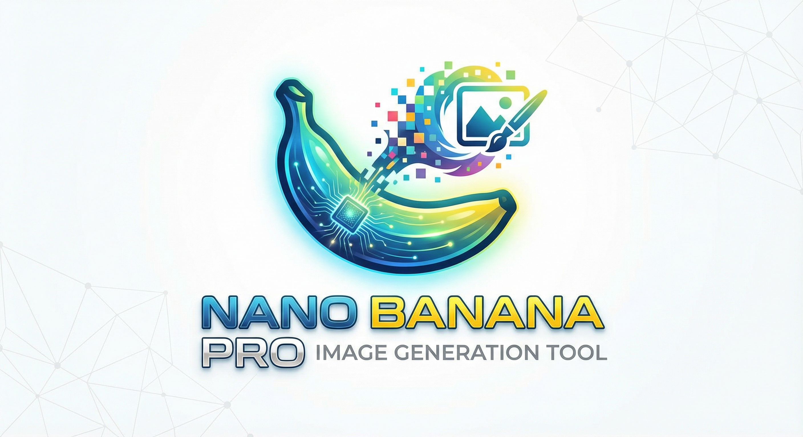

# Nano Banana Pro

A powerful, feature-rich Gemini image generation client that runs entirely in your browser.

<p align="center">
  
</p>

## Features

### Authentication

- **API Key** - Use your Gemini API key directly
- **Vertex AI** - Enterprise auth with Service Account JSON (JWT signing in-browser)
- Auto-refresh tokens & retry on auth errors

### Image Generation

- All Gemini image models (gemini-2.0-flash, gemini-3-pro, imagen-3, etc.)
- **1K / 2K / 4K** resolution options
- 10 aspect ratios including ultrawide 21:9
- Configurable thinking mode with budget slider
- Google Search grounding for real-world accuracy
- Auto-retry with exponential backoff

### Reference Images

- Up to **14 reference images** per generation
- Auto-compression to 2560px max (saves bandwidth)
- Drag & drop, paste from clipboard, or click to upload
- **Iterate** button adds output to references for refinement
- Undo clear with 5-second restore window

### History & Favorites

- Persistent storage via IndexedDB
- Thumbnail generation for fast browsing
- Favorites system with filtering
- Load prompts from history
- Clear all (preserves favorites)

### Image Viewing

- Pinch-to-zoom (mobile) / Mouse wheel (desktop)
- Pan when zoomed
- Fullscreen modal with zoom controls
- Download & copy to clipboard

### Mobile Optimized

- Pinch-to-zoom on images
- Double-tap to zoom/reset
- Haptic feedback
- Touch-friendly UI
- Fullscreen prompt editor for comfortable typing

### Prompt Editor

- **Fullscreen mode** - Click expand button or press `Ctrl+Shift+F`
- Character counter
- Works on all platforms (desktop & mobile)

## Quick Start

### Option 1: One-Click Launchers

**Windows** - Double-click `start-hidden.vbs` to run the server in the background (no terminal window)

**Termux/Android** - Run `bash start-termux.sh` to start the server in the background

**Standard** - Double-click `start.bat` (Windows) or run `./start.sh` (Linux/Mac)

### Option 2: Manual Start

```bash
# Clone the repo
git clone https://github.com/yourusername/nano-banana-pro.git
cd nano-banana-pro

# Start local server
npx serve -l 3000
# or
python -m http.server 3000
```

Then open <http://localhost:3000>

### Option 3: GitHub Pages

Fork this repo and enable GitHub Pages in Settings → Pages → Deploy from `main` branch.

> **Note**: ES modules require a local server. Opening `index.html` directly via `file://` won't work.

## Getting Your API Key

### Gemini API Key

1. Go to [Google AI Studio](https://aistudio.google.com/apikey)
2. Create or select a project
3. Generate an API key
4. Paste it in the app

### Vertex AI (Enterprise)

1. Create a Service Account in Google Cloud Console
2. Grant it `Vertex AI User` role
3. Download the JSON key file
4. Drop the file in the app

## Project Structure

```
nano-banana-pro/
├── index.html          # Entry point
├── start.bat           # Windows launcher (with terminal)
├── start.sh            # Linux/Mac launcher
├── start-hidden.vbs    # Windows launcher (no terminal)
├── start-termux.sh     # Termux/Android launcher
├── css/
│   ├── variables.css   # Design tokens (colors, spacing)
│   ├── base.css        # Reset, typography
│   ├── components.css  # Buttons, inputs, toggles
│   ├── layout.css      # Container, responsive grid
│   ├── modals.css      # Fullscreen, history, preview, prompt editor
│   └── utilities.css   # Animations, helpers
├── js/
│   ├── app.js          # Entry point & initialization
│   ├── config.js       # Constants
│   ├── auth.js         # API key & Vertex AI auth
│   ├── api.js          # API calls with retry logic
│   ├── models.js       # Model loading
│   ├── generation.js   # Image generation orchestration
│   ├── references.js   # Reference image handling
│   ├── history.js      # IndexedDB operations
│   ├── zoom.js         # Pinch-to-zoom controls
│   ├── ui.js           # Toast, haptics, DOM helpers, prompt editor
│   ├── persistence.js  # LocalStorage management
│   └── prompts.js      # Saved prompts management
└── assets/             # Banner image
```

## Keyboard Shortcuts

| Shortcut | Action |
|----------|--------|
| `Ctrl+Enter` | Generate image |
| `Ctrl+Shift+F` | Open fullscreen prompt editor |
| `Escape` | Close fullscreen/modals |
| `+` / `-` / `0` | Zoom in/out/reset (in fullscreen) |

## Data Storage

All data stays in your browser:

| Type | Storage | Contents |
|------|---------|----------|
| Credentials | localStorage | API key, service account JSON |
| Settings | localStorage | UI preferences, last model |
| Reference Images | localStorage | Base64 compressed images |
| Generated Images | IndexedDB | Full images + thumbnails |
| Session Stats | sessionStorage | Generation count |

**Nothing is sent to any server except the Gemini/Vertex API for generation.**

## Browser Support

| Browser | Minimum Version |
|---------|-----------------|
| Chrome | 90+ |
| Firefox | 90+ |
| Edge | 90+ |
| Safari | 15+ |

## Development

No build tools required! Edit files directly and refresh.

```bash
# Watch for changes (optional)
npx serve --reload
```

## License

MIT License - do whatever you want with it!
